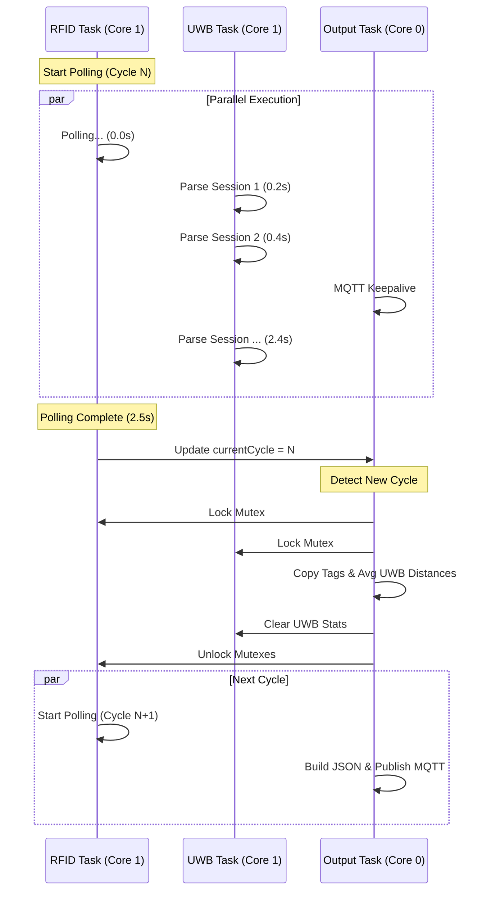

# OptiFlow Firmware Architecture: RFID + UWB + MQTT

This document details the multi-tasking architecture of the ESP32-S3 firmware, designed to synchronize high-latency RFID polling with real-time UWB positioning and MQTT communication.

## 1. System Overview

The system uses **FreeRTOS** to manage three concurrent tasks distributed across the ESP32-S3's dual cores. The architecture is designed to ensure that heavy network operations (MQTT/JSON) do not block sensor data acquisition.

### Core Assignment Map

| Core | Task | Priority | Responsibility |
|------|------|----------|----------------|
| **Core 0** | `Output Task` | 1 (Low) | WiFi Stack, MQTT Keepalive, JSON Building, Publishing |
| **Core 1** | `RFID Task` | 2 (High) | **MASTER CLOCK**, RFID Polling (Blocking I/O) |
| **Core 1** | `UWB Task` | 2 (High) | Continuous UART Parsing, Data Accumulation |
| **Core 1** | `loop()` | 0 (Idle) | Minimal Serial Command Handling |

---

## 2. Task Roles & Synchronization

### A. RFID Task (The Master Clock) ⏱️
*Running on Core 1*

This task dictates the system's "heartbeat". Because RFID polling is a blocking operation that takes significant time (1.5 - 3.0 seconds), it naturally defines the data cycle.

**Workflow:**
1. **Polls RFID Module**: Executes `rfid.pollingMultiple(30)`, blocking for ~2s.
2. **Locks Mutex**: Acquires `rfidMutex`.
3. **Updates Buffer**: Copies up to `RFID_MAX_TAGS` into shared memory.
4. **Increments Cycle**: Updates `currentCycle` counter (protected by `cycleMutex`).
5. **Restarts**: Immediately begins the next polling cycle.

> **Key Concept**: The completion of an RFID poll triggers the Output Task to process data.

### B. UWB Task (The Accumulator) 📡
*Running on Core 1*

This task runs asynchronously, continuously parsing the high-speed UART stream from the DWM3001CDK module.

**Workflow:**
1. **Parses UART**: Reads byte-by-byte looking for `SESSION_INFO_NTF`.
2. **Extracts Data**: Parses JSON-like UWB session data (MAC, Distance, Status).
3. **Accumulates Stats with Time-Based Expiration**: 
   - Instead of overwriting, it **accumulates** measurements in `anchorStatsMap`.
   - Each entry is timestamped when updated.
   - **Automatic Staleness Removal**: Entries older than 3 seconds are purged automatically.
   - **Circular Buffer**: Limited to 30 anchors. When full, replaces the oldest entry.
   - Calculates running totals for distance and success counts.

> **Key Concept**: The system maintains a rolling 3-second window of UWB data. This ensures data freshness regardless of network connectivity, preventing stale measurements from being published after outages.

### C. Output Task (The Synchronizer) 🔗
*Running on Core 0*

This task bridges the sensor world (Core 1) and the network world (Core 0). It waits for the RFID task to signal a completed cycle.

**Workflow:**
1. **Non-Blocking Reconnect**: Attempts MQTT connection every 5 seconds if disconnected (no blocking loops).
2. **MQTT Keepalive**: Calls `mqttClient.loop()` every 10ms when connected.
3. **Cycle Detection**: Checks if `currentCycle > lastPrintedCycle`.
4. **Data Fusion**:
   - **Locks Mutexes**: Pauses sensor updates briefly.
   - **Snapshots Data**: Copies latest RFID tags and accumulated UWB stats (only fresh data < 3s old).
   - **Clears UWB Stats**: Resets `anchorStatsMap` for the next cycle.
5. **Conditional Processing**:
   - If **MQTT connected**: Build JSON and publish.
   - If **MQTT offline**: Drop data immediately to ensure freshness (no queuing or buffering).
6. **Processing**:
   - Calculates average UWB distances (`totalDistance / successCount`).
   - Builds a large JSON document (up to 4KB).
7. **Publishing**: Sends the JSON payload to `store/aisle1` via MQTT.

### D. Memory Management Strategy

The system operates within the ESP32-S3's 512KB RAM constraints using a strict memory layout:

1. **Task Stacks (Static)**:
   - Each task is allocated a fixed **16KB stack**.
   - This is sufficient for local variables, including the `RFIDTagData` struct array (~6KB).
   - **Safety**: Stack usage is deterministic and safe from overflow.

2. **Heap (Dynamic)**:
   - **String Data**: The actual character data for RFID EPCs and UWB MACs lives here.
   - **MQTT Buffer**: A large **32KB buffer** is allocated on the heap to handle the worst-case JSON payload (200 tags + 30 anchors).
   - **UWB Map**: The `std::map` for anchor stats grows dynamically but is capped at **30 entries** to prevent heap exhaustion. Uses a circular buffer approach with timestamp-based expiration.

> **Note**: The 32KB MQTT buffer is critical. A full payload (200 tags + 30 anchors) can exceed 16KB. The standard 4KB or 8KB buffers would cause silent publication failures.

---

## 3. Data Flow Timeline

A typical 2.5-second system cycle looks like this:



## 4. Critical Configuration Parameters

| Parameter | Value | Description |
|-----------|-------|-------------|
| `RFID_POLLING_COUNT` | 30 | Number of hardware scan cycles per poll. Determines cycle duration (~2s). |
| `RFID_MAX_TAGS` | 200 | Maximum unique tags stored per cycle. Matches library limit. |
| `UWB_MAX_ANCHORS` | 30 | Circular buffer size for UWB anchors. When full, replaces oldest entry. |
| `UWB_FRESHNESS_MS` | 3000 | Data validity window (3 seconds). Older entries are auto-purged. |
| `UWB_BUFFER_SIZE` | 2048 | UART buffer size for UWB session data. |
| `MQTT_BUFFER_SIZE` | 32768 | Max JSON payload size (32KB). |
| `MQTT_RECONNECT_INTERVAL` | 5000 | Non-blocking reconnect attempt interval (5 seconds). |

## 5. Why This Architecture?

1. **Non-Blocking Network**: MQTT publishing can take 100ms+. By moving it to Core 0 (Output Task), the RFID and UWB tasks on Core 1 never miss a beat.
2. **Data Coherency**: UWB data is averaged exactly over the duration of the RFID scan, providing a synchronized "snapshot" of the environment.
3. **Stability**: Separating the WiFi stack (Core 0) from the time-sensitive UART/SPI sensor communication (Core 1) prevents watchdog resets and buffer overflows.
4. **Resilience**: Time-based data expiration and non-blocking reconnects ensure the system gracefully handles network outages without accumulating stale data.

---

## 6. Offline Behavior & Data Freshness

The system implements a **"Drop-and-Expire"** policy to handle network instability without compromising data integrity.

### Policy: Time-Based Freshness with Offline Dropping

1. **Automatic Expiration**:
   - Every UWB measurement entry in `anchorStatsMap` is timestamped.
   - Before processing new measurements, entries older than **3 seconds** are automatically purged.
   - This happens continuously, independent of network state.

2. **Circular Buffer**:
   - The `anchorStatsMap` is limited to **30 entries**.
   - When a new anchor appears and the buffer is full, the **oldest entry** (by timestamp) is replaced.
   - This prevents memory exhaustion while maintaining fresh data.

3. **Non-Blocking Reconnection**:
   - The Output Task attempts to reconnect every **5 seconds** if MQTT is disconnected.
   - **No blocking loops**: The system continues collecting sensor data during outages.

4. **Offline Data Dropping**:
   - If MQTT is unavailable when a cycle completes, the data is **dropped immediately**.
   - No buffering or queuing of offline data is performed to prevent memory exhaustion and latency buildup.

5. **Freshness Guarantee**:
   - The UWB stats map is **cleared after every cycle**, regardless of whether data was published or dropped.
   - When the connection is restored, the first published message contains only **fresh, real-time data** from active measurements within the last 3 seconds.

**Key Benefit**: The system never publishes stale data. Whether the outage lasts 5 seconds or 5 minutes, the first post-reconnection message reflects the current state, not accumulated history.

---

## 7. JSON Output Format

The firmware outputs data in a structured JSON format that matches the reference implementation (`RFID+UWB_TEST`). This format is used for both Serial Monitor output and MQTT publishing.

### JSON Schema

```json
{
  "polling_cycle": 1,
  "timestamp": 123456,
  "uwb": {
    "n_anchors": 2,
    "anchors": [
      {
        "mac_address": "0xABCD",
        "average_distance_cm": 150.5,
        "measurements": 3,
        "total_sessions": 5
      }
    ]
  },
  "rfid": {
    "tag_count": 2,
    "tags": [
      {
        "epc": "E200001234567890ABCD",
        "rssi_dbm": -45
      }
    ]
  }
}
```

### Field Descriptions

| Field | Type | Description |
|-------|------|-------------|
| `polling_cycle` | Integer | Incrementing cycle counter (starts at 1) |
| `timestamp` | Integer | Milliseconds since boot (`millis()`) |
| **UWB Section** | | |
| `uwb.n_anchors` | Integer | Number of anchors with valid data |
| `uwb.anchors[]` | Array | List of anchor measurements |
| `uwb.anchors[].mac_address` | String | Anchor MAC address (prefixed with `0x`) |
| `uwb.anchors[].average_distance_cm` | Float/null | Averaged distance over the cycle, or `null` if no successful measurements |
| `uwb.anchors[].measurements` | Integer | Number of successful distance readings |
| `uwb.anchors[].total_sessions` | Integer | Total UWB sessions (including failures) |
| `uwb.available` | Boolean | Only present when `false` (no UWB data) |
| **RFID Section** | | |
| `rfid.tag_count` | Integer | Number of unique tags detected |
| `rfid.tags[]` | Array | List of detected RFID tags |
| `rfid.tags[].epc` | String | Electronic Product Code (24 hex characters) |
| `rfid.tags[].rssi_dbm` | Integer | Signal strength in dBm (typically -70 to -30) |

### Example: No UWB Data Available

When no UWB anchors are detected, the `uwb` section contains only:

```json
{
  "polling_cycle": 1,
  "timestamp": 123456,
  "uwb": {
    "available": false
  },
  "rfid": {
    "tag_count": 0,
    "tags": []
  }
}
```

---

## 8. Debugging & Observability

The firmware includes a compile-time debug switch:
- **`DEBUG_MODE 1`**: Enables verbose serial output for development (Task startup, heap status, MQTT events).
- **`DEBUG_MODE 0`**: Disables all non-essential serial prints for production efficiency.

All debug prints use the `DEBUG_PRINT()` macro, allowing the entire logging system to be compiled out for maximum performance.

---

## 9. UWB Hardware Configuration

### Anchor MAC Addresses

The system uses **Qorvo DWM3001CDK** modules with CLI firmware configured in FiRa ONE_TO_MANY mode.

| Device | Role | MAC Address | CLI Command |
|--------|------|-------------|-------------|
| **Tag** | Controller/Initiator | `0x0000` | `INITF -MULTI -ADDR=0 -PADDR=[1,2,3,4] ...` |
| **Anchor 1** | Responder | `0x0001` | `RESPF -MULTI -ADDR=1 -PADDR=0 ...` |
| **Anchor 2** | Responder | `0x0002` | `RESPF -MULTI -ADDR=2 -PADDR=0 ...` |
| **Anchor 3** | Responder | `0x0003` | `RESPF -MULTI -ADDR=3 -PADDR=0 ...` |
| **Anchor 4** | Responder | `0x0004` | `RESPF -MULTI -ADDR=4 -PADDR=0 ...` |

### Ranging Protocol

| Parameter | Value | Description |
|-----------|-------|-------------|
| Protocol | FiRa DS-TWR | Double-Sided Two-Way Ranging |
| Mode | ONE_TO_MANY | 1 tag → multiple anchors |
| Channel | 9 | UWB channel |
| Block Duration | 200ms | Update rate: 5 Hz |
| Session ID | 42 | Shared across all devices |
| Max Anchors | 8 | FiRa TWR protocol limit |

### Example Ranging Output

```
SESSION_INFO_NTF: {session_handle=1, sequence_number=1, block_index=1, n_measurements=4
 [mac_address=0x0001, status="SUCCESS", distance[cm]=245];
 [mac_address=0x0002, status="SUCCESS", distance[cm]=312];
 [mac_address=0x0003, status="SUCCESS", distance[cm]=189];
 [mac_address=0x0004, status="SUCCESS", distance[cm]=403]}
```

### Adding More Anchors

To scale to 8 anchors (maximum for FiRa TWR):

1. Configure additional anchors with addresses `0x0005` through `0x0008`
2. Update the tag's `PADDR` list: `PADDR=[1,2,3,4,5,6,7,8]`
3. Increase block duration if needed: `-BLOCK=300` (for 8 anchors)

> **Note**: For setups exceeding 8 anchors, UCI firmware with programmatic control is required. See `firmware/old/UWB_TEST/MULTI_ANCHOR_ARCHITECTURE.md` for details.