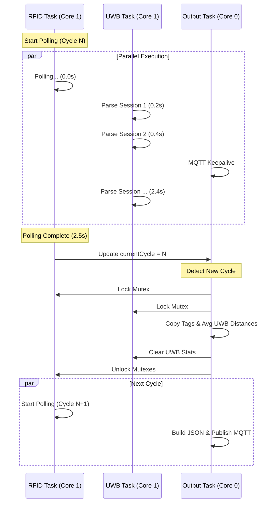

# OptiFlow Firmware Architecture: RFID + UWB + MQTT

This document details the multi-tasking architecture of the ESP32-S3 firmware, designed to synchronize high-latency RFID polling with real-time UWB positioning and MQTT communication.

## 1. System Overview

The system uses **FreeRTOS** to manage three concurrent tasks distributed across the ESP32-S3's dual cores. The architecture is designed to ensure that heavy network operations (MQTT/JSON) do not block sensor data acquisition.

### Core Assignment Map

| Core | Task | Priority | Responsibility |
|------|------|----------|----------------|
| **Core 0** | `Output Task` | 1 (Low) | WiFi Stack, MQTT Keepalive, JSON Building, Publishing |
| **Core 1** | `RFID Task` | 2 (High) | **MASTER CLOCK**, RFID Polling (Blocking I/O) |
| **Core 1** | `UWB Task` | 2 (High) | Continuous UART Parsing, Data Accumulation |
| **Core 1** | `loop()` | 0 (Idle) | Minimal Serial Command Handling |

---

## 2. Task Roles & Synchronization

### A. RFID Task (The Master Clock) ⏱️
*Running on Core 1*

This task dictates the system's "heartbeat". Because RFID polling is a blocking operation that takes significant time (1.5 - 3.0 seconds), it naturally defines the data cycle.

**Workflow:**
1. **Polls RFID Module**: Executes `rfid.pollingMultiple(30)`, blocking for ~2s.
2. **Locks Mutex**: Acquires `rfidMutex`.
3. **Updates Buffer**: Copies up to `RFID_MAX_TAGS` (200) into shared memory.
4. **Increments Cycle**: Updates `currentCycle` counter (protected by `cycleMutex`).
5. **Restarts**: Immediately begins the next polling cycle.

> **Key Concept**: The completion of an RFID poll triggers the Output Task to process data.

### B. UWB Task (The Accumulator) 📡
*Running on Core 1*

This task runs asynchronously, continuously parsing the high-speed UART stream from the DWM3001CDK module.

**Workflow:**
1. **Parses UART**: Reads byte-by-byte looking for `SESSION_INFO_NTF`.
2. **Extracts Data**: Parses JSON-like UWB session data (MAC, Distance, Status).
3. **Accumulates Stats**: 
   - Instead of overwriting, it **accumulates** measurements in `anchorStatsMap`.
   - Calculates running totals for distance and success counts.
   - This allows averaging multiple UWB measurements over the duration of one RFID cycle.

> **Key Concept**: During one 2-second RFID cycle, the UWB task might capture and average 10-15 separate distance measurements per anchor.

### C. Output Task (The Synchronizer) 🔗
*Running on Core 0*

This task bridges the sensor world (Core 1) and the network world (Core 0). It waits for the RFID task to signal a completed cycle.

**Workflow:**
1. **MQTT Keepalive**: Calls `mqttClient.loop()` every 10ms to maintain connection.
2. **Cycle Detection**: Checks if `currentCycle > lastPrintedCycle`.
3. **Data Fusion**:
   - **Locks Mutexes**: Pauses sensor updates briefly.
   - **Snapshots Data**: Copies latest RFID tags and accumulated UWB stats.
   - **Clears UWB Stats**: Resets `anchorStatsMap` for the next cycle.
4. **Processing**:
   - Calculates average UWB distances (`totalDistance / successCount`).
   - Builds a large JSON document (up to 4KB).
5. **Publishing**: Sends the JSON payload to `store/aisle1` via MQTT.

---

## 3. Data Flow Timeline

A typical 2.5-second system cycle looks like this:

## 4. Critical Configuration Parameters

| Parameter | Value | Description |
|-----------|-------|-------------|
| `RFID_POLLING_COUNT` | 30 | Number of hardware scan cycles per poll. Determines cycle duration (~2s). |
| `RFID_MAX_TAGS` | 200 | Maximum unique tags stored per cycle. Matches library limit. |
| `UWB_BUFFER_SIZE` | 2048 | UART buffer size for UWB session data. |
| `MQTT_BUFFER_SIZE` | 4096 | Max JSON payload size. |

## 5. Why This Architecture?

1. **Non-Blocking Network**: MQTT publishing can take 100ms+. By moving it to Core 0 (Output Task), the RFID and UWB tasks on Core 1 never miss a beat.
2. **Data Coherency**: UWB data is averaged exactly over the duration of the RFID scan, providing a synchronized "snapshot" of the environment.
3. **Stability**: Separating the WiFi stack (Core 0) from the time-sensitive UART/SPI sensor communication (Core 1) prevents watchdog resets and buffer overflows.
